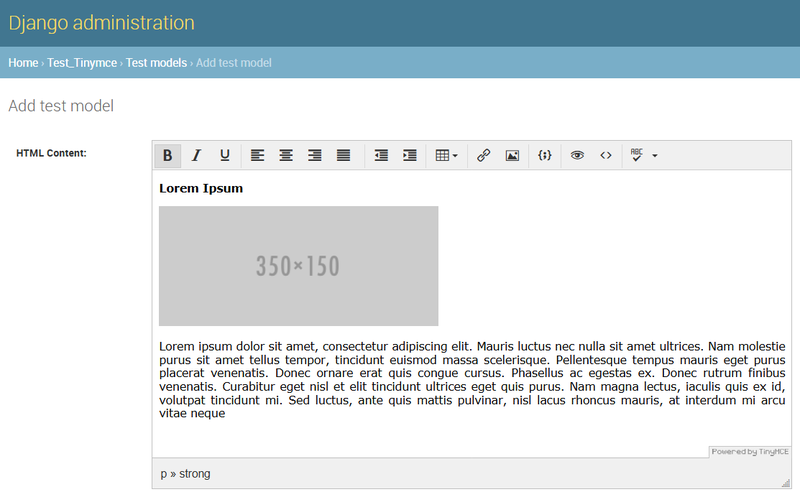

Welcome to django-tinymce4-lite documentation!
==============================================

**django-tinymce4-lite** is a reworked fork of `django-tinymce4`_. It provides a `TinyMCE 4`_
editor widget that can be used in Django forms and models.

  *TinyMCE 4 editor in Django Admin interface*

In this fork all legacy and broken code has been cleaned in order to provide simple
but full-featured TinyMCE 4 experience in Django projects.

**django-tinymce4-lite** can use `django-filebrowser-no-grappelli`_
as a file manager for TinyMCE 4 to insert images and file links into edited text.

.. note:: Currently ``django-filebrowser`` (grapelli-based) is not compatible
  with **django-tinymce4-lite** because it lacks support for TinyMCE 4. See this
  `pull request <https://github.com/sehmaschine/django-filebrowser/pull/255>`_
  for more details.

The application also includes a spellchecker service for TinyMCE 4 spellchecker
plugin.

Compatibility
-------------

- **Python**: 2.7, 3+ (2.7 support to be removed)
- **Django**: 1.11-2.1

.. note:: I try to keep **django-tinymce4-lite** up to date with current Python and Django versions,
  but third-party packages, like filebrowsers, may be incompatible with the latest Python/Django.
  It's up to those packages' authors/maintainers to keep their work in sync with recent developments.

License
-------

- **django-tinymce4-lite** software: `MIT license <https://en.wikipedia.org/wiki/MIT_License>`_.
- This documentation: `CC BY-SA 4.0 <https://creativecommons.org/licenses/by-sa/4.0/>`_.

Naming Conventions
------------------

In this documentation **django-tinymce4-lite** or **tinymce4-lite** (all lowercase) refers to this
Python/Django application, and **TinyMCE 4** or **TinyMCE** (CamelCase) refers to
a JavaScript `TinyMCE`_ editor widget. If a version number is omitted, TinyMCE v.4.x.x is assumed.

.. _django-tinymce4: https://github.com/dani0805/django-tinymce4
.. _TinyMCE 4: https://www.tinymce.com/
.. _django-filebrowser: https://github.com/sehmaschine/django-filebrowser
.. _django-filebrowser-no-grappelli: https://github.com/smacker/django-filebrowser-no-grappelli
.. _TinyMCE: https://www.tinymce.com/

Contents:
---------

.. toctree::
  :maxdepth: 2

  installation
  configuration
  usage
  advanced
  test
  modules
  changelog

Indices and tables
==================

* :ref:`genindex`
* :ref:`search`
